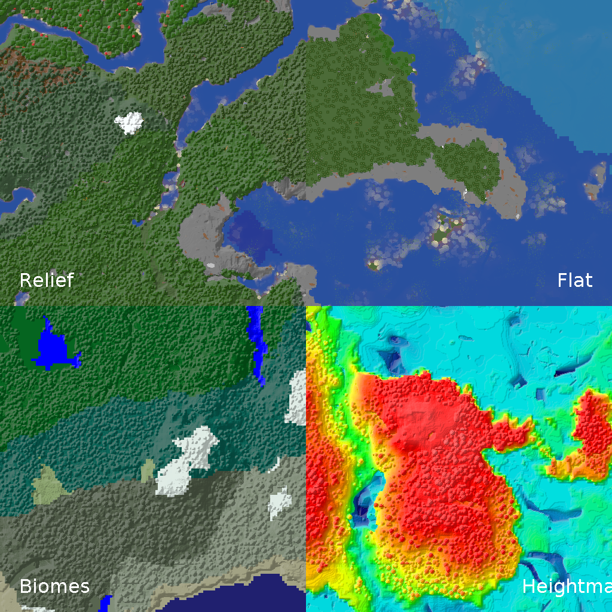
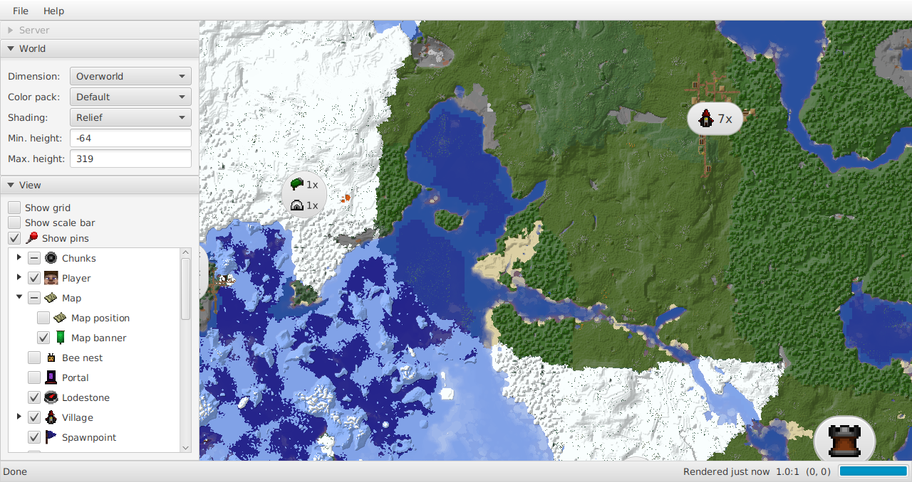

# BlockMap - A Minecraft 1.13/1.14 world viewer

*This started as fork of [TMCMR](https://github.com/TOGoS/TMCMR), but has been almost completely rewritten due to the update. If you want something stable that works with 1.12 and before worlds, go check it out.*

## Features:
- An interactive GUI viewer made with JavaFX
- Pins on the map show additional information like players and villages
- Different color maps and shaders that highlight exactly what you are looking for (including an underground caves and an ocean ground view)
- A gui library to include maps into your own JavaFX applications (but not released yet)
- A command line interface to render your worlds from scripts
- The core rendering code as library to use in your own projects (releasing soon)
- Rendering scale: 1 pixel : 1 block
- Really fast
- Works with huge worlds
- Works on servers
- Gamma corrected rendering
- Works with both 1.13 and 1.14
- **Screenshots below!**

## Requirements:

- Java 11+
- Minecraft 1.13+ worlds. Chunks from before the release (even from 1.13 snapshots) will be ignored. Please optimize your worlds in Minecraft before rendering them

## Download:

Download the latest version from the [Release page](https://github.com/piegamesde/BlockMap/releases).

## Usage:

The GUI version should just run by (double)clicking it. Otherwise run it through:

    java -jar BlockMap-1.4.0.jar

to start. If you want to use BlockMap through the command line without GUI (not only for scripts),

    # For general usage help
    java -jar BlockMap-1.4.0.jar help
    # For help about rendering worlds to a folder
    java -jar BlockMap-1.4.0.jar help render
    # For help about saving rendered worlds
    java -jar BlockMap-1.4.0.jar render help save

will get you started. On Linux even with colors!

If your world has been created before the Minecraft 1.13 release, please optimize it. To do this, start Minecraft, select your world, go to "Edit" and then "Optimize World".

**GUI controls:**

- Mouse wheel to zoom in and out
- Drag with the right mouse button to pan the view
  - This will very likely change in the future
  - If you drag to the edge, the mouse will wrap around so you can drag indefinitely. Blender users will appreciate this
- When loading a world, you can select either a world folder, a region folder or a single region file

**Server usage:**

The bash script [server.sh](server.sh) is an example of how this could be used in a server environment. Simply set the paths at the top of the file and call this script regularly on the server. It has a few different render settings pre-configured, but they are easy to adapt to your needs.

## Mod support:

Currently, no Minecraft mods are supported, but the rendering engine is built in an extensible way. Mod support will only be implemented on request.

## Compile it yourself:

Due to technical, legal and performance reasons, some resources required to run and test BlockMap are not included in this repository, but generated locally. The Gradle task `regenerate` will download all required files (you only need an internet connection the first time and after a `clean`) and generate and compile a bunch of stuff. Without this, nothing will work. On a freshly cloned repository, use `initEclipse` or `initIdea` to transform the repository into a project you can simply open in your favorite IDE. (Warning: The `eclipse` and `idea` tasks have to be called each time some dependencies changed. Furthermore, they link to some folders in the build directory. This means that they won't work as intended until `regenerate` has been called.)

The task `beforeCommit` will clean and regenerate all resources and run all the tests to check if everything works (poor man's CI). The task `github` will take the code and the resources into a fat standalone jar. The jar file will be placed into `BlockMap-standalone/build/libs/`. Similar files will be placed in the other subprojects (`BlockMap-core`, `BlockMap-gui`). Those are the library versions of BlockMap (not released yet) and not executable.

All screenshots (see them below) are generated automatically through the gradle task `generateScreenshots`. This way, they are always up to date with the latest version. Be aware that this task needs to generate a fairly large Minecraft world first and then render it, which takes both time and space and will cause gradle to slow down a lot.

**Notice — run from Gradle:**

There is a bug in JavaFX that currently prevents the `run` task to work, so as a workaround use `./gradlew run2` for now.

**Quick start:**

    git clone https://github.com/Minecraft-Technik-Wiki/BlockMap
    cd BlockMap
    ./gradlew regenerate
    ./gradlew run2

## Troubleshooting

If you cannot start the GUI and you get errors similar to

    java.lang.IllegalAccessError: superclass access check failed: class impl.org.controlsfx.behavior.RangeSliderBehavior (in unnamed module @0xa1d113b) cannot access class com.sun.javafx.scene.control.behavior.BehaviorBase (in module javafx.controls) because module javafx.controls does not export com.sun.javafx.scene.control.behavior to unnamed module @0xa1d113b
please try the *Quick start* section above. This is a known JavaFX bug, please try the workaround before reporting.

## Gallery

